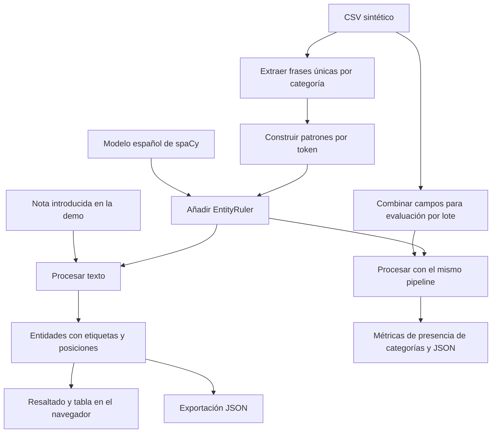

# Sistema de Anotaciones Automáticas en Registros Electrónicos de Salud (Tesis)

Código fuente y datos sintéticos del trabajo de graduación:

**“Diseño e Implementación de un Sistema para Anotaciones Automáticas en Registros Electrónicos de Salud mediante NLP y ML”**  
Autor: **Alberto Gabriel Reyes Ning**  
Universidad de San Carlos de Guatemala – Facultad de Ingeniería  
Mayo, 2025

## Descripción

Prototipo de anotación de texto clínico en español. Carga el modelo preentrenado
`es_dep_news_trf` de spaCy y añade un `EntityRuler` con frases extraídas de un CSV
sintético. Las reglas asignan las etiquetas `SINTOMA`, `DIAGNOSTICO`,
`TRATAMIENTO` y `PROCEDIMIENTO` mediante coincidencias de tokens que ignoran
mayúsculas y minúsculas.

Los scripts actuales no entrenan ni ajustan un modelo clínico. Las etiquetas
clínicas proceden de las reglas. La demo permite editar notas, visualizar las
entidades y descargar los resultados como JSON.

## Instalación en Windows (PowerShell)

Desde la raíz del repositorio, usando Python 3.12 (versión utilizada para probar
la demo):

```powershell
cd scripts
python -m venv env
Set-ExecutionPolicy -Scope Process -ExecutionPolicy Bypass
.\env\Scripts\Activate.ps1
python -m pip install spacy spacy-transformers pandas
python -m spacy download es_dep_news_trf
```

El cambio de política se aplica únicamente a la terminal actual. Si el entorno
ya existe, omite su creación. La instalación de dependencias y la descarga del
modelo pueden tardar varios minutos. Espera a que termine cada comando.

Estas instrucciones sustituyen el uso de `env.bat`, que conserva instrucciones
mezcladas de Windows y Linux/macOS y necesita correcciones antes de utilizarse.

## Iniciar la demo

Con el entorno activado, desde `scripts`:

```powershell
python realizar_prueba.py
```

Espera el mensaje `Demo lista` y abre **http://localhost:5000**. El modelo se
carga una sola vez al iniciar. El servidor escucha en `127.0.0.1:5000`.
Detén una instancia anterior con **Ctrl+C** antes de iniciar otra.

La interfaz incluye:

- Una nota editable y ejemplos completos, de paráfrasis y de negación.
- Ocho frases de prueba: dos por cada categoría, que se añaden a la nota al pulsarlas.
- Texto resaltado, tabla de entidades, número de categorías y tiempo de procesamiento.
- Descarga de JSON con la nota, las entidades, sus posiciones y el tiempo.

Cada análisis también actualiza `scripts/outputs/resultado_prueba.json` con
las entidades detectadas. El tiempo mostrado excluye la carga inicial del modelo
y la comunicación con el navegador.

Consulta [el recorrido de demostración](scripts/DEMO.md) para preparar una presentación.

## Flujo del sistema



## Evaluación por lote

Desde `scripts`, con el entorno activado:

```powershell
python evaluar_prototipo.py
```

Imprime precisión, exhaustividad, F1 y tiempo promedio, y genera
`outputs/resultados_evaluacion.json`.

**Alcance de las métricas actuales:** el evaluador comprueba la presencia de las
cuatro categorías en cada registro; no compara entidades individuales ni sus
límites con anotaciones de referencia. Las reglas se construyen a partir del
mismo CSV que se evalúa. Además, todas las etiquetas permitidas se consideran
esperadas, por lo que la rama de falsos positivos no puede ejecutarse: la
precisión es 1 cuando hay predicciones contabilizadas.

El README original reportaba precisión 1.00, exhaustividad 0.97, F1 0.98 y
0.05 segundos por registro. Son resultados históricos del evaluador existente;
no constituyen una validación independiente de extracción de entidades. Para
medir generalización se necesita un conjunto separado con entidades y posiciones
anotadas, incluyendo ejemplos negativos y variantes de redacción.

## Estructura

```text
prototipo-nlp-clinico/
├── .gitignore
├── README.md
└── scripts/
    ├── data/notas_clinicas_sinteticas.csv
    ├── outputs/                         # Generados; ignorados por Git
    ├── env/                             # Entorno local; ignorado por Git
    ├── demo.html                        # Interfaz de la demo
    ├── DEMO.md                          # Recorrido de presentación
    ├── realizar_prueba.py               # Servidor local y API de anotación
    ├── nlp_pipeline.py                  # Modelo y reglas clínicas
    ├── evaluar_prototipo.py             # Evaluación por lote
    ├── generar_csv.py                   # Generador de 100 registros sintéticos
    ├── spacy_load.py                    # Descarga del modelo español
    ├── config.cfg                       # Configuración no usada por la demo
    └── env.bat                          # Script heredado; ver instalación arriba
```

El CSV ya está incluido. Para regenerarlo instala `faker` y ejecuta
`python generar_csv.py` desde `scripts`. Esto sobrescribe el CSV existente y
puede modificar el vocabulario utilizado por las reglas.

## Limitaciones

- Las reglas reconocen frases conocidas; pueden omitir sinónimos o paráfrasis.
- No se interpreta negación, temporalidad ni certeza: una frase negada también puede coincidir.
- Los patrones usan `phrase.split()`, que puede diferir de la tokenización de spaCy con signos de puntuación o guiones.
- Las categorías se derivan de columnas del CSV, incluyendo frases completas de observaciones.
- El generador combina campos aleatoriamente y puede producir registros clínicamente inconsistentes.

## Aviso ético y legal

Este proyecto no utiliza datos reales de pacientes. Los registros fueron
creados sintéticamente con fines académicos. El prototipo no está diseñado
para producción médica y no debe utilizarse con fines clínicos reales sin
validación profesional adicional.

## Licencia

El código del repositorio se publica bajo la [licencia MIT](LICENSE).
Los modelos y dependencias conservan sus propias licencias.

## Contacto

**Alberto Gabriel Reyes Ning**  
agrn96p@gmail.com
